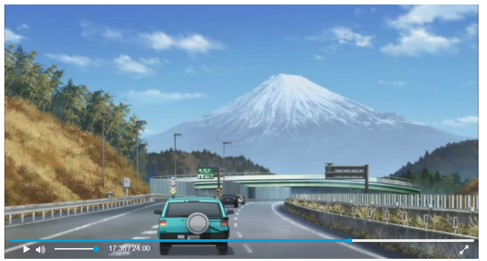

# vue-player

> It's a customize player developed in Vue.js.


#Test
[Try it](https://tranquil-meteorology.glitch.me/#/demo/vueplayer)


## Example
```html
<Player src="your_video_address"/>
<!-- src: http(s)://www.yourVideoAddress......  -->
```

## Hotkeys
#### Left Arrow: jump 5 sec. back
#### Right Arrow: jump 5 sec. forward
#### Up Arrow: volume increase
#### Down Arrow: volume decrease
#### Space: play/pause
#### K: play/pause
#### Esc: leave fullscreen mode

## P.S.

If you have any question or something to report, please let me know.
